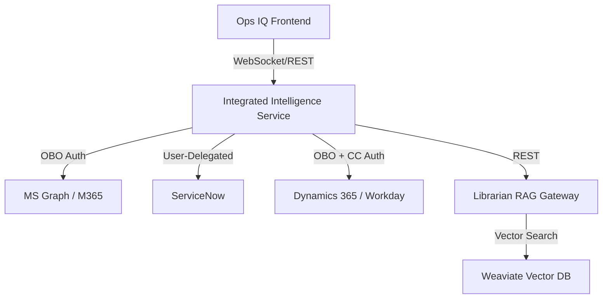

# Ops IQ: Integrated Intelligence Service (IIS)

A unified Agentic AI platform designed for enterprise automation, featuring robust governance, observability, and specialized integration with Microsoft 365, Dynamics 365, Workday, and ServiceNow.

---

## 🏗️ Architecture Overview

Ops IQ follows a **Stateless Pivot** architecture, centered around the **Integrated Intelligence Service (IIS)**. IIS acts as the master orchestrator, security hub, and identity mediator for all downstream enterprise systems.



### Core Components
- **iis/**: The "Brain" (FastAPI + AutoGen). Handles multi-agent orchestration, security filtering, and identity traversal.
- **librarian/**: Enterprise RAG gateway (Python + Weaviate). Manages document ingestion and semantic retrieval.
- **frontend/**: Main Ops IQ UI (React + Vite + Tauri). Powering the unified desktop experience.
- **knowledge-hub-ui/**: Specialized administrative UI for managing enterprise document lifecycles.

---

## 🛡️ Core Pillars

### 1. Identity & Security (Entra ID Consolidation)
- **Identity Traversal**: Consolidates user identity across multiple platforms.
- **On-Behalf-Of (OBO) Flows**: Exchanges incoming user tokens for specialized downstream scopes (e.g., `graph.microsoft.com`, `servicenow`).
- **Scoped Context Pattern**: Thread-local context propagation for tokens and user personas across agent tool calls.
- **Mock Auth Traversal Strategy**: A dedicated "Guest" mode that uses mock token persistence for local development and demos.
- **Semantic Firewall**: Multi-layered protection using **NVIDIA NeMo Guardrails** combined with a custom LLM-based fallback classifier to block out-of-scope requests.
- **PII Protection**: **Microsoft Presidio** for automated detection and redaction of sensitive data (SSN, emails, phone numbers) in user inputs and LLM outputs.

### 2. Generative UI (JIT Manifests)
- **Structured UI Manifests**: Agents do not just return text; they emit structured payloads for `table`, `form`, `pills`, and `hero` components.
- **Defensive Rendering**: The `SafeRender` (Stringify Guard) prevents React crashes from malformed LLM outputs or nested objects.
- **Discovery Manifest Sync**: Deterministic "Discovery" menus (Area/Tool pills) are synchronized via the Planner to guide users through available capabilities.

### 3. Full-Stack Observability
- **Distributed Tracing**: End-to-end visibility using **OpenTelemetry** and **traceloop**.
- **DataDog Intelligence**: Agents report intentions, tool outcomes, and security intercepts (PII counts, firewall blocks) directly to DataDog.

### 4. Enterprise Knowledge Hub (RAG)
- **Document Lifecycle**: Supports **Active**, **Deactivated** (soft-delete), and **Permanently Deleted** document states.
- **Local Vectorization**: High-privacy processing using `text2vec-transformers`.

### 5. Reasoning Transparency (NEW)
- **Structured Emit Format**: Agent reasoning steps are emitted as structured JSON with `stage`, `status`, `tool`, and `message`.
- **Visual Reasoning Trail**: Frontend displays step-by-step AI thought process with icons (🔒🎯🤖⚙️📊🎨).
- **Collapsible UI**: Moveworks-inspired expandable reasoning panel.

### 6. Time Entry Assistant (PLANNED)
- **AI Pre-Drafting**: Generates weekly timesheets from M365 Calendar + Workday projects.
- **Chat-Based Entry**: "Log 2 hours for Acme client meeting" via natural language.
- **Hybrid Storage**: IndexedDB (offline) + PostgreSQL (sync) with multi-device support.
- **Smart Nudges**: Daily/Friday reminders with in-app banners.
- See [Time Entry Assistant Spec](./docs/time_entry_assistant.md) for full details.

### 7. Local LLM Support
- **LM Studio / Ollama**: Development with local models via `LOCAL_LLM_ENABLED=true`.
- **Model Switching**: UI selector for cloud (Azure OpenAI) vs local models.

---

## 📊 Success Criteria

Ops IQ success is measured across three tiers:

### 🟢 Tier 1: Leading Indicators (Adoption & Engagement)
| Metric | Target |
|--------|--------|
| Monthly Active Users (MAU) | ≥ 60% of target workforce |
| Session Frequency | ≥ 3 sessions/user/week |
| Natural Language Adoption | > 60% within 6 months |
| Reasoning Trail Engagement | > 40% of users |

### 🔵 Tier 2: Lagging Indicators (Business Outcomes)
| Metric | Target |
|--------|--------|
| Manual Task Reduction | ≥ 2 hours saved/employee/week |
| Process Cycle Time | ≥ 50% reduction |
| Ticket Deflection Rate | ≥ 40% |
| Task Completion Rate | ≥ 85% |
| Knowledge Retrieval Precision | ≥ 75% |

### 🔴 Tier 3: Guardrail Metrics (Risk & Compliance)
| Metric | Target |
|--------|--------|
| PII Interception Rate | 100% |
| Semantic Firewall Accuracy | ≥ 95% |
| Audit Trail Completeness | 100% |
| Time-to-First-Response | < 2 seconds |
| User Satisfaction (CSAT) | ≥ 4.2 / 5.0 |

---

## 🚀 Getting Started

### Prerequisites
- **Python 3.13**
- **Node.js 18+**
- **PostgreSQL** (via `asyncpg`)
- **Weaviate** (Local or Containerized)

### Quick Start
1.  **Backend (IIS):**
    ```bash
    cd iis
    python -m venv .venv
    .venv\Scripts\activate
    pip install -r requirements.txt
    uvicorn main:app --reload --port 8000
    ```
2.  **Librarian (Knowledge Hub API):**
    ```bash
    cd librarian
    # Target Architecture: Weaviate on http://localhost:8080, Postgres on 5432
    python main.py # Runs on port 8001
    ```
3.  **Frontend (Main UI):**
    ```bash
    cd frontend
    npm install
    npm run dev
    ```

---

## 📚 Documentation
- [Project Maintenance Guide](./PROJECT_MAINTENANCE.md): Deep dive into architectural layers and configuration.
- [Identity Patterns](./iis/core/auth.py): Implementation of OBO and Client Credentials flows.

---

## 📄 License
This project is proprietary and confidential.
