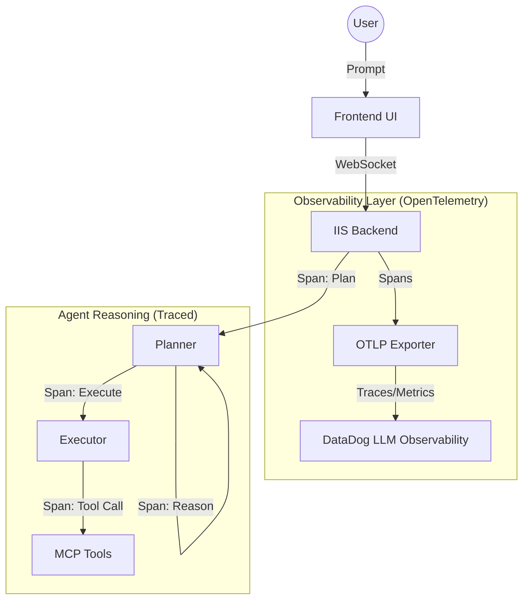

# AI Observability Strategy

This document outlines the plan for implementing comprehensive observability for the Agentic AI solution, leveraging the existing **DataDog** environment and **OpenTelemetry**.

## Objective
To transform the "black box" agentic reasoning into a transparent, debuggable, and auditable system by tracing every step of the Planner, Executor, and Tool calls.

## Architecture Diagram

## Key Components

### 1. DataDog Integration
- **Native Support**: Leverage DataDog's native support for OpenTelemetry GenAI Semantic Conventions (v1.37+).
- **Unified View**: Correlate AI traces with existing APM, logs, and infrastructure metrics.
- **Dashboards**: Monitor token usage, cost, latency, and model performance.

### 2. OpenTelemetry Instrumentation
- **Library**: Use `openllmetry` (OpenTelemetry-based) for standard instrumentations of LLM providers.
- **Custom Spans**: 
    - **Planner Span**: Records the goal and the high-level plan.
    - **Reasoning Span**: Records the internal "thinking" steps (matching our `thought` events).
    - **Tool Span**: Records inputs, outputs, and execution time for each MCP tool call.

### 3. Captured Metadata (Attributes)
Every AI trace will include:
- `gen_ai.request.model`: Model used (e.g., GPT-4o).
- `gen_ai.usage.input_tokens`: Prompt token count.
- `gen_ai.usage.output_tokens`: Completion token count.
- `app.session_id`: Correlated session ID from our DB.
- `app.user_id`: Persona information for audit trails.
- `tool.name` & `tool.input`: Specifics of what the agent "did" in the real world.

## Implementation Phases

### Phase 1: Foundation
- [ ] Install OpenTelemetry SDKs (`opentelemetry-api`, `opentelemetry-sdk`, `opentelemetry-exporter-otlp`).
- [ ] Configure the OTLP exporter to point to the DataDog Agent.
- [ ] Initialize basic tracing in `main.py`.

### Phase 2: Agent-Specific Tracing
- [ ] Wrap `PlannerAgent.process_message` in a trace span.
- [ ] Add sub-spans for tool execution within the planner loop.
- [ ] Export prompt/response as attributes (redacting sensitive PII as discussed).

### Phase 3: Monitoring & Evals
- [ ] Build DataDog dashboards for "Chain of Thought" visibility.
- [ ] Set up alerts on "Reasoning Loops" or high-latency tool calls.
