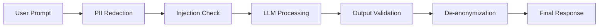

# Guardrails & PII Protection Strategy

This document outlines the security architecture for the Agentic AI solution, focusing on protecting sensitive data (PII) and ensuring the agent remains safe, reliable, and on-track.

## Objectives
1. **Prevent PII Leakage**: Ensure sensitive data never reaches the LLM provider.
2. **Mitigate Prompt Injection**: Protect the system from malicious user attempts to override instructions.
3. **Eliminate Hallucinations**: Validate LLM outputs against ground truth (tool results).
4. **Enforce Topic Control**: Ensure the agent stays within the scope of D365, Workday, and ServiceNow.

## Security Architecture: The Semantic Firewall

We will implement a **Multi-Layer Defensive Proxy** (The IIS Layer) between the User and the LLM.

## Key Components

### 1. PII Protection (Microsoft Presidio)
- **Workflow**:
    - **Inbound**: Scan user prompts for names, emails, SSNs, and salaries. Replace with placeholders (e.g., `[PERSON_1]`).
    - **Outbound**: Re-inject the original values into the final response before it's displayed to the user.
- **Why**: Keeps the LLM provider out of the compliance loop for sensitive data.

### 2. Input Guardrails (NeMo Guardrails)
- **Topic Mapping**: Use "Colang" to define allowed topics. Any prompt about "recipes" or "vacation plans" is intercepted at the source.
- **Jailbreak Detection**: Use Small Language Model (SLM) classifiers to detect and block adversarial prompts (e.g., "Ignore all previous instructions...").

### 3. Output Validation (Guardrails AI)
- **Structured Verification**: Ensure the LLM's response strictly follows the JSON schema required for GenUI.
- **Fact Checking**: Compare the LLM's summary against the actual MCP Tool output. If the tool says "Transaction Failed" but the LLM says "Success," the guardrail triggers a retry or an error message.

## Implementation Phases

### Phase 1: PII Sanitization
- [ ] Integrate `presidio-analyzer` and `presidio-anonymizer` into the IIS middleware.
- [ ] Implement a local mapping store for de-anonymization.

### Phase 2: Input/Output Filtering
- [ ] Define the "Semantic Firewall" rules using Colang for NeMo Guardrails.
- [ ] Implement Pydantic-based output validators for mission-critical tool responses.

### Phase 3: Red-Teaming & Hardening
- [ ] Conduct "Prompt Injection" tests to identify edge cases.
- [ ] Refine "Negative Constraint" instructions in the system prompt.
