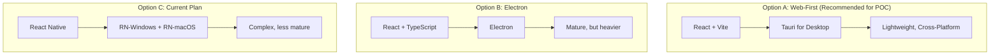

# AI Agent Architecture: Overview & Implementation Details

## Executive Summary

Your project vision is solid: a conversational AI agent that replaces complex business processes with single commands + human confirmation. However, several tech stack choices and task sequencing decisions could be optimized for faster development and reduced complexity.

---

## 🔍 Tech Stack Assessment

### 1. Frontend: React Native (TypeScript)

| Aspect | Current Choice | Assessment | Recommendation |
|--------|----------------|------------|----------------|
| Framework | React Native | ⚠️ **Concern** | Consider alternatives |
| Desktop Support | "Flutter/React Native Desktop" | ❌ **Issue** | Clarify platform priority |

> [!WARNING]
> **React Native Desktop Support is Limited**
> 
> React Native doesn't have mature desktop support. You'd need:
> - `react-native-windows` (Microsoft-maintained, decent)
> - `react-native-macos` (less mature)
> 
> For a POC targeting Mac/Windows, this adds significant complexity.

**Recommended Alternatives:**

| Option | Pros | Cons | Best For |
|--------|------|------|----------|
| **Tauri + React** | Lightweight (~10MB), Rust backend, modern | Newer ecosystem | Fast POC, performance-focused |
| **Electron + React** | Mature, huge ecosystem, easy debugging | Heavy (~100MB+), memory hungry | Enterprise, feature-rich apps |
| **React Native** | True native, mobile-ready | Weak desktop support, complexity | Mobile-first apps |

**My Recommendation**: For a **POC**, use **React + Vite** running in browser first, then wrap with **Tauri** for desktop if needed. This decouples UI development from desktop packaging.

---

### 2. Agent Core: AutoGen Framework (Python)

| Aspect | Current Choice | Assessment |
|--------|----------------|------------|
| Framework | AutoGen AgentChat | ✅ **Good Choice** |
| Multi-Agent | Planner + RAG + Executor | ✅ **Solid Architecture** |

> [!TIP]
> AutoGen is excellent for multi-agent orchestration. However, consider the complexity level:

**Alternative Consideration:**

| Scenario | Recommended Framework |
|----------|----------------------|
| Complex multi-agent with dynamic conversations | **AutoGen** ✅ (your choice) |
| Simpler linear workflows with tool calling | **LangGraph** (lighter weight) |
| Single agent with tools | **Plain LangChain** or **OpenAI Assistants API** |

For your use case (structured Planner → RAG → Executor), AutoGen is appropriate, but **LangGraph** could achieve the same with less boilerplate if you find AutoGen too heavy.

---

### 3. API Mediation: FastAPI + MCP Server

| Aspect | Current Choice | Assessment |
|--------|----------------|------------|
| Framework | FastAPI | ✅ **Excellent** |
| Protocol | MCP Server | ✅ **Anthropic's Model Context Protocol** |

**Recommendation**: FastAPI is perfect. Using **FastAPI with MCP SDK** for Anthropic's protocol.

---

### 4. Planning Source: Config Files with Rule Engine

| Aspect | Original Choice | Final Decision |
|--------|----------------|----------------|
| Approach | RAG for plan retrieval | YAML config files with rule engine |
| Data Source | Vector DB (mock YAML) | Simple YAML files with conditional logic |

**Final Decision**: YAML configuration files with a simple rule engine for:
- Deterministic execution (no hallucination)
- Conditional branching (if/else logic)
- State machine validation (valid transitions)
- Role-based step authorization
- Template variable substitution

---

### 5. Identity/Auth: Microsoft Entra ID

| Aspect | Current Choice | Assessment |
|--------|----------------|------------|
| Provider | Microsoft Entra ID | ✅ **Enterprise-appropriate** |
| Token Type | OAuth 2.0 Delegated | ✅ **Correct for user context** |
| POC Approach | Mocked tokens | ✅ **Pragmatic** |

**No changes recommended.** Your approach is solid.

---

## 📊 Final Tech Stack Decision

| Component | Technology | Rationale |
|-----------|------------|-----------|
| **Frontend** | React + Vite + TypeScript | Best Generative UI ecosystem |
| **Desktop Wrapper** | Tauri | Lightweight, OTA-capable, Rust performance |
| **Agent Core** | AutoGen | Multi-agent orchestration |
| **API Server** | FastAPI + MCP SDK | Anthropic protocol compliance |
| **Planning** | YAML + Rule Engine | Deterministic with conditional logic |
| **Real-time Comms** | WebSocket | Best UX for streaming updates |
| **Auth** | Mock Entra ID (POC) | Real integration later |

---

## 🛠️ Key Architectural Patterns

### 1. The Discovery Chain (Guided UX)
Instead of relying on users to type commands, the agent proactively guides them through a multi-step discovery process:
1. **Initial Greeting**: Triggered by a hidden `"hi"` message upon authentication.
2. **Area Selection**: The `PlannerAgent` offers high-level domains (e.g., Dynamics 365, Workday) as "Selection Pills".
3. **Tool Discovery**: Selecting an area triggers the agent to fetch and suggest contextual tools (e.g., "List Accounts", "Create Opportunity").
4. **Action Execution**: Clicking a tool pill leads to the structured execution phase.

### 2. Just-in-Time (JIT) UI Generation
To maintain a zero-maintenance frontend, we use a **UI Manifest** pattern:
- The `PlannerAgent` output is parsed by a **Manifest Generator**.
- It produces a structured JSON (`componentType`, `payload`).
- The Frontend renders the appropriate component (Table, Form, Pills) dynamically based on the tool's JSON Schema.

### 3. Multi-MCP Integration Layer
The system supports multiple independent backends via the **Model Context Protocol (MCP)**:
- **FastAPI BFF**: Acts as a gateway to multiple MCP servers.
- **Dynamic Introspection**: Tools are discovered at runtime from D365 and Workday servers simultaneously.
- **Protocol Gating**: RBAC is applied at the BFF layer before tool execution.
