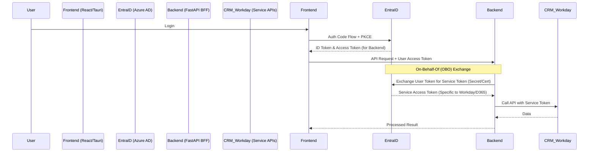

# Azure AD (Entra ID) Security Architecture & Implementation Plan

This document outlines the strategy for securing **Ops IQ** using Microsoft Entra ID. The architecture uses **PKCE** for frontend authentication and the **On-Behalf-Of (OBO)** flow for backend-mediated calls to Workday and D365 CRM.

## 1. High-Level Architecture (OBO Flow)

In this model, the Frontend never sees the Service Tokens (Workday/D365). Instead, it delegates authority to the Backend BFF.

## 2. Configuration & Identity Details

- **Tenant Model**: Single-Tenant (Limited to your organization).
- **Identity Provider**: Microsoft Entra ID.
- **Service Integration**: Both Workday and D365 CRM are registered in the same tenant, simplifying trust relationships and cross-service scoping.

## 3. Implementation Phases

### Phase 1: Azure Portal Configuration
- **Frontend App Registration**: 
    - Platform: SPA.
    - Permissions: `api://ops-iq-backend/access_as_user`.
- **Backend App Registration**:
    - **Expose an API**: Create scope `access_as_user`.
    - **API Permissions**: Add `user_impersonation` for Dynamics CRM and the Workday API scopes.
    - **Credentials**: Generate a **Client Secret** or upload a **Certificate** for the OBO exchange.

### Phase 2: React Frontend Integration
- **Dependency**: `@azure/msal-react`, `@azure/msal-browser`.
- **Logic**: Acquire an access token specifically for the **Backend ID** (not the third-party services).
- **Persistence**: MSAL handles token caching and silent refresh.

### Phase 3: FastAPI Backend & OBO Logic
- **Validation**: Verify incoming User Tokens (JWT).
- **OBO Exchange**: Use the `msal` Python library to exchange the user's token for a Workday or D365 token.
- **Service Clients**: Implement specialized clients for D365 and Workday that use the refreshed OBO tokens.

## 4. Task List

| Step | Component | Task | Description |
| :--- | :--- | :--- | :--- |
| **1.1** | Azure | Frontend Reg | Register SPA, configure Redirects (`tauri://localhost`). |
| **1.2** | Azure | Backend Reg | Register Web API, expose `access_as_user` scope. |
| **1.3** | Azure | OBO Config | Add Client Secret to Backend; grant Admin Consent for Service Scopes. |
| **2.1** | Frontend | MSAL Setup | Implement `MsalProvider` and `useMsal` in `AuthContext`. |
| **2.2** | Frontend | API Interceptor | Update `agentSocket` and Fetch calls to include Bearer token. |
| **3.1** | Backend | Validation | Implement Entra ID JWT validation (Single Tenant issuer check). |
| **3.2** | Backend | OBO Service | Implement `get_token_on_behalf_of` using `msal-python`. |
| **3.3** | Backend | API Proxies | Create endpoints for Workday/D365 that utilize OBO tokens. |
