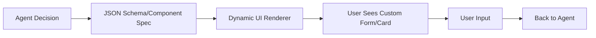
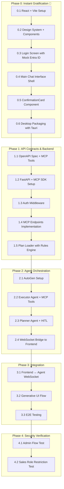

# AI Agent Prototype: Implementation Plan v2

> **Revision Notes**: Updated based on user feedback. Key changes:
> - Phase 0 restructured for "instant gratification" (working UI + Auth first)
> - Generative UI assessment added
> - Config-based planning with conditional logic support
> - WebSocket for real-time updates confirmed
> - Anthropic MCP SDK integration confirmed

---

## 🎯 Confirmed Requirements

| Requirement | Decision |
|-------------|----------|
| Platform | Desktop primary (.exe for Windows) |
| MCP Protocol | Anthropic's Model Context Protocol ✅ |
| Business Processes | < 10 (across different systems) |
| Real-time Updates | WebSocket (preferred for UX) |
| Generative UI | **Must-have** requirement |
| OTA Updates | Nice-to-have, not critical for POC |

---

## 🖼️ Generative UI Framework Assessment

Since Generative UI is a **must-have**, here's why React was chosen:

### What is Generative UI?



### Framework Comparison for Generative UI

| Capability | React (Web/Tauri/Electron) | React Native |
|------------|---------------------------|--------------|
| **JSON Schema Forms** | ✅ Excellent (`@rjsf/core`, `react-jsonschema-form`) | ⚠️ Limited (manual implementation) |
| **Dynamic Component Rendering** | ✅ Native (JSX from JSON) | ✅ Possible but complex |
| **Streaming UI Updates** | ✅ Excellent (React Server Components, Suspense) | ⚠️ More complex |
| **Rich Component Libraries** | ✅ Massive ecosystem (Radix, shadcn, MUI) | ⚠️ Smaller ecosystem |
| **AI SDK Integration** | ✅ Vercel AI SDK has built-in Generative UI | ❌ Not available |

**Winner: React (Web)** - The Vercel AI SDK's `streamUI` function is specifically designed for this use case.

---

## 📋 Config-Based Planning with Conditional Logic

Enhanced YAML format that supports conditions and branching:

```yaml
# plans/client_onboarding_stage_update.yaml
plan_id: client_onboarding_stage_update
name: "Client Onboarding Stage Update"
description: "Update client stage and optionally assign owner"
required_roles: 
  - APP_ROLE_ADMIN
  - APP_ROLE_SALES

# Steps with conditional logic
steps:
  - id: lookup_client
    action: mcp_api_lookup_client
    description: "Retrieve client details"
    input_mapping:
      client_id: "{{input.client_id}}"
    output_variable: client_data

  - id: check_stage_transition
    action: validate_rule
    description: "Validate stage transition is allowed"
    rule:
      type: state_machine
      allowed_transitions:
        prospect: [qualified, closed_lost]
        qualified: [negotiation, closed_lost]
        negotiation: [closed_won, closed_lost]

  - id: display_confirmation
    action: generative_ui
    component: ConfirmationCard
    schema:
      clientName: "{{client_data.name}}"
      currentStage: "{{client_data.current_stage}}"
      newStage: "{{input.new_stage}}"
    requires_confirmation: true

  - id: update_stage
    action: mcp_api_update_stage
    condition: "{{confirmation.newOwner}} == {{client_data.owner}}"
    on_condition_false:
      next_step: assign_owner

  - id: assign_owner
    action: mcp_api_assign_owner
    required_roles: [APP_ROLE_ADMIN]
```

---

## 🚀 Phase Structure



---

## 📝 Detailed Task Breakdown

### Phase 0: Instant Gratification (Working UI First!)

**Goal**: See a beautiful, functional desktop app with login within the first few hours.

| ID | Task | Description | Artifacts |
|----|------|-------------|-----------|
| **0.1** | Project Setup | Initialize React + Vite + TypeScript project | `package.json`, `vite.config.ts` |
| **0.2** | Design System | Create CSS variables, base components, dark mode | `styles/`, `components/ui/` |
| **0.3** | Login Screen | Mock Entra ID login with token storage (localStorage for POC) | `pages/Login.tsx`, `services/auth.ts` |
| **0.4** | Chat Interface | Main layout with chat messages area + input | `pages/Chat.tsx`, `components/ChatMessage.tsx` |
| **0.5** | ConfirmationCard | Dynamic form component using JSON Schema | `components/ConfirmationCard.tsx` |
| **0.6** | Tauri Integration | Package as Windows .exe with basic window chrome | `src-tauri/`, `tauri.conf.json` |

**Deliverable**: A working `.exe` that shows login → chat interface → sample confirmation card.

---

### Phase 1: API Contracts & Backend

| ID | Task | Description | Artifacts |
|----|------|-------------|-----------|
| **1.1** | API Contracts | Define OpenAPI spec + MCP tool definitions | `openapi.yaml`, `mcp_tools.json` |
| **1.2** | FastAPI + MCP SDK | Set up FastAPI with Anthropic MCP SDK integration | `backend/main.py` |
| **1.3** | Auth Middleware | JWT validation, role extraction from claims | `backend/middleware/auth.py` |
| **1.4** | MCP Endpoints | `lookup_client`, `update_stage`, `assign_owner` | `backend/tools/` |
| **1.5** | Plan Loader | YAML-based plan loading with rule engine | `backend/services/plan_executor.py`, `plans/` |

---

### Phase 2: Agent Orchestration

| ID | Task | Description | Artifacts |
|----|------|-------------|-----------|
| **2.1** | AutoGen Setup | Initialize AutoGen with basic agent structure | `orchestrator/main.py` |
| **2.2** | Executor Agent | MCP tool bindings, execution logic | `orchestrator/agents/executor.py` |
| **2.3** | Planner Agent | Plan execution with HITL pause points | `orchestrator/agents/planner.py` |
| **2.4** | WebSocket Bridge | Real-time communication with frontend | `orchestrator/ws_server.py` |

---

### Phase 3: Integration

| ID | Task | Description | Artifacts |
|----|------|-------------|-----------|
| **3.1** | WebSocket Client | Frontend WebSocket service for agent comms | `frontend/services/agentSocket.ts` |
| **3.2** | Generative UI Flow | Agent → JSON Schema → ConfirmationCard → Response | Integration tests |
| **3.3** | E2E Testing | Full flow: prompt → lookup → confirm → execute | Test recordings |

---

### Phase 4: Security Verification

| ID | Task | Description | Artifacts |
|----|------|-------------|-----------|
| **4.1** | Admin Flow | Complete workflow with APP_ROLE_ADMIN token | Success logs |
| **4.2** | Sales Restriction | Sales user blocked from `assign_owner` | 403 response logs |

---

## 📁 Project Structure

```
agent-ui/
├── docs/                        # Documentation
│   ├── architecture_review.md
│   └── implementation_plan.md
├── frontend/                    # React + Vite + Tauri
│   ├── src/
│   │   ├── components/
│   │   │   ├── ui/              # Base components (Button, Input, Card)
│   │   │   ├── ChatMessage.tsx
│   │   │   └── ConfirmationCard.tsx
│   │   ├── pages/
│   │   │   ├── Login.tsx
│   │   │   └── Chat.tsx
│   │   ├── services/
│   │   │   ├── auth.ts          # Mock Entra ID
│   │   │   └── agentSocket.ts   # WebSocket client
│   │   ├── styles/
│   │   │   └── globals.css      # Design system
│   │   ├── App.tsx
│   │   └── main.tsx
│   ├── src-tauri/               # Tauri (Rust) backend
│   │   ├── src/
│   │   │   └── main.rs
│   │   └── tauri.conf.json
│   ├── package.json
│   └── vite.config.ts
│
├── backend/                     # FastAPI + MCP SDK
│   ├── app/
│   │   ├── main.py
│   │   ├── middleware/
│   │   │   └── auth.py
│   │   ├── tools/               # MCP tool implementations
│   │   │   ├── lookup_client.py
│   │   │   ├── update_stage.py
│   │   │   └── assign_owner.py
│   │   ├── services/
│   │   │   └── plan_executor.py
│   │   └── schemas/
│   │       └── confirmation.py
│   ├── plans/                   # YAML plan definitions
│   │   └── client_onboarding_stage_update.yaml
│   ├── requirements.txt
│   └── pyproject.toml
│
└── orchestrator/                # AutoGen agents
    ├── main.py
    ├── agents/
    │   ├── executor.py
    │   └── planner.py
    ├── ws_server.py             # WebSocket server
    └── requirements.txt
```

---

## ✅ Final Tech Stack Decision

| Component | Technology | Rationale |
|-----------|------------|-----------|
| **Frontend** | React + Vite + TypeScript | Best Generative UI ecosystem |
| **Desktop Wrapper** | Tauri | Lightweight, OTA-capable, Rust performance |
| **Agent Core** | AutoGen | Multi-agent orchestration |
| **API Server** | FastAPI + MCP SDK | Anthropic protocol compliance |
| **Planning** | YAML + Rule Engine | Deterministic with conditional logic |
| **Real-time Comms** | WebSocket | Best UX for streaming updates |
| **Auth** | Mock Entra ID (POC) | Real integration later |
