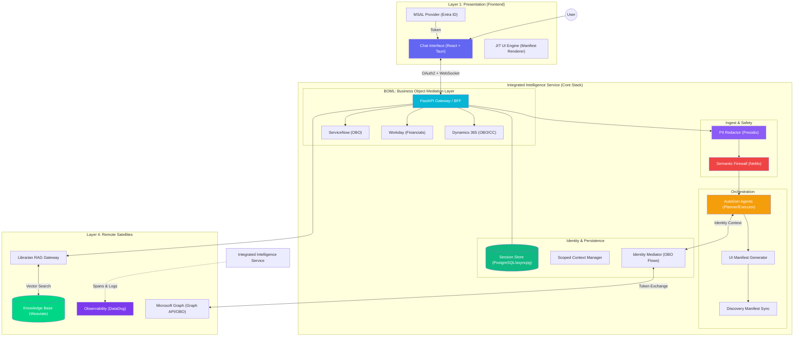

# Ops IQ: System Architecture (POV Target State)

This document visualizes the high-performance **Integrated Intelligence Service (IIS)** architecture, which collapses orchestration, identity mediation, and core business tools into a unified execution layer.

## 🏗️ 4-Layer Architecture (Integrated)

---

## 📋 Technical Component Mapping

| Layer | Technical Name / Component | Purpose |
| :--- | :--- | :--- |
| **Presentation** | **React (Vite) + Tauri** | Premium desktop shell with MSAL.js integration for Entra ID authentication. |
| | **JIT UI Engine** | Renders structured payloads (`table`, `form`, `pills`) using the **SafeRender (Stringify Guard)** pattern. |
| **Orchestration** | **AutoGen 0.7.x** | Multi-agent framework orchestrating the **Planner** (Reasoning) and **Executor** (Tools). |
| | **Discovery Sync** | Deterministic synchronization of "Area" and "Tool" selection pills to guide user intent. |
| **Identity** | **OBO (On-Behalf-Of)** | Centralized token exchange for downstream resources like MS Graph and ServiceNow. |
| | **Scoped Context** | Python thread-local storage propagating user permissions and tokens across agent tasks. |
| **Safety** | **PII Redactor (Presidio)** | Multi-entity sensitive data masking across all logs, traces, and LLM payloads. |
| | **Semantic Firewall** | Multi-layered protection using **NeMo Guardrails** and custom LLM domain classifiers. |
| **Knowledge Hub** | **Librarian Gateway** | FastAPI service managing document chunking and metadata. Supports **Active/Deactivated/Deleted** states. |
| | **Weaviate + text2vec** | On-premises vector storage with local transformer-based embedding generation. |
| **Persistence** | **PostgreSQL (asyncpg)** | High-performance, async central database for session retention (Last 20 sessions / 5 days). |
| **Mediation** | **BOML Layer** | Standardized mediation for D365, Workday, and ServiceNow. Supports **OBO & Client-Credentials** with **Multi-Tenant/Multi-Environment** resolution for D365. |

---

> [!IMPORTANT]
> **Identity Consolidation**: All downstream tools must use the `auth_user_ctx` to ensure data access respects the authenticated user's permissions.

> [!TIP]
> **Mermaid Preview**: Use the [Mermaid Live Editor](https://mermaid.live/) to visualize or modify the flow diagram asynchronously.
