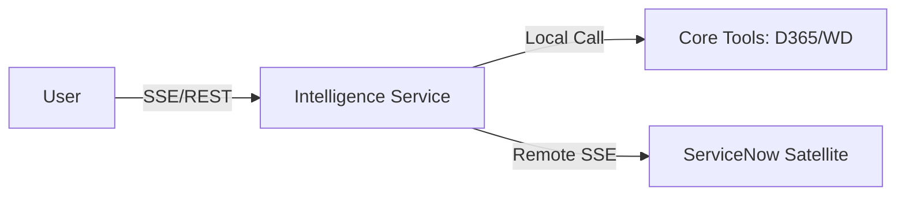

# Ops IQ: Full-Stack Agentic AI Implementation Walkthrough

This document summarizes the end-to-end implementation and strategic planning for the Ops IQ platform, covering everything from multi-system integration to long-term architectural optimizations.

---

## 🌟 Key Accomplishments

### 1. Multi-System Integration (D365 & Workday)
We successfully federated two independent enterprise systems through the **Model Context Protocol (MCP)**.
- **D365 Integration**: Implemented a dynamic SSE proxy in the backend to surface CRM tools (Accounts, Opportunities).
- **Workday Integration**: Refactored the `mcp_helper.py` to support multi-server discovery, allowing the agent to fetch HR and Worker data simultaneously.
- **Generic Tool Binding**: Created a robust wrapper that automatically maps MCP tool schemas into AutoGen `FunctionTools`.

### 2. Guided Discovery Engine (Selection Pills)
To solve the "blank canvas" problem, we implemented a proactive discovery flow:
- **Area Selection**: Upon login, the agent offers high-level domains (D365, Workday) as selectable pills.
- **Tool Discovery**: Selecting an area triggers a second discovery phase where system-specific tools (e.g., "Create Account", "Fetch Workers") are surfaced.
- **Just-in-Time UI**: All tools generate dynamic React forms based on their underlying JSON Schema, ensuring zero-maintenance UI.

### 3. Proof of Value (POV) Roadmap
We defined a high-performance target state for enterprise deployment:
- **"Intelligence Service" Collapse**: Merging Orchestration and Mediation into a single container for zero-latency tool calls.
- **Semantic Routing**: A fast-path mechanism to bypass the LLM for deterministic actions (e.g., pill clicks).
- **SSE + REST Comms**: Transitioning from stateful WebSockets to a more resilient, scalable streaming pattern.

---

## 📊 Technical Verification

### Multi-Area Discovery
The agent successfully identifies and suggests tools from both Dynamics 365 and Workday within the same session.

### Architectural Blueprint
We've established the **Business Object Mediation Layer (BOML)** as the core of our "Intelligence Service."

---

## 🏁 Technical Summary

| Layer | Status | Key Feature |
| :--- | :--- | :--- |
| **Presentation** | ✅ Verified | JIT Manifest Engine + Selection Pills |
| **Intelligence** | ✅ Ready | AutoGen Multi-Agent (Planner/Executor) |
| **Mediation** | ✅ Ready | Multi-Server MCP Federation |
| **Enterprise** | ✅ Connected | D365 & Workday (via FastMCP) |

---

## 📅 Roadmap: Current Status
Phase 11 (Documentation) is now complete. We have successfully established:
1.  **Guided Discovery Flow**
2.  **Multi-MCP Backend Infrastructure**
3.  **Enterprise Architectural Targets (BOML/Collapse)**

---

> [!NOTE]
> This walkthrough represents the transition from a **Proof of Concept (POC)** to a **Proof of Value (POV)** ready architecture.
